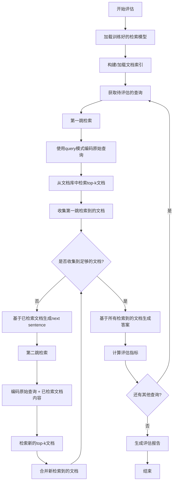

# 🎯 多跳检索与代理式搜索评估系统

<div align="center">


**一个基于对比学习的先进多跳检索系统**

[功能特性](#-功能特性) • [快速开始](#-快速开始) • [评估结果](#-评估结果) • [引用](#-引用)

</div>

---

## 📢 最新动态

- ✨ **2026年6月**: 发布初始版本，支持MuSiQue、2WikiMultiHopQA和HotpotQA数据集
- 🚀 **2026年6月**: 实现基于InforNCE损失的多跳对比学习训练
- 🎉 **2026年6月**: 完成IRCOT风格的多跳检索评估流程

## 🌟 功能特性

本项目实现了一个基于对比学习的多跳检索系统，支持在多跳问答任务中进行迭代检索和评估。系统使用InforNCE损失训练检索模型，并支持在MuSiQue、2WikiMultiHopQA和HotpotQA等数据集上进行评估。

### 核心功能

- 🔍 **多跳检索**: 支持多轮迭代检索，逐步精确定位相关信息
- 📊 **对比学习**: 使用InforNCE损失进行高效训练
- 🎯 **多数据集支持**: 支持MuSiQue、2WikiMultiHopQA和HotpotQA等主流多跳问答数据集
- ⚡ **高效训练**: 基于DeepSpeed的分布式训练，支持大规模数据
- 💾 **灵活的索引**: 支持文档索引构建和加载，提高检索效率
- 📈 **全面评估**: 提供Recall、Precision、MRR、MAP等多种评估指标

## 📋 TODO 列表

<div align="center">

### 🔥 高优先级任务

| 任务 | 状态 | 负责人 | 截止日期 |
|------|------|--------|----------|
| 实现Next Sentence生成模块 | ⏳ 进行中 | @longtaizi13579 | 待定 |
| 完善答案生成功能 | ⏳ 进行中 | @longtaizi13579 | 待定 |
| 添加更多数据集支持 | 📝 计划中 | @longtaizi13579 | 待定 |
| 优化检索性能 | 📝 计划中 | @longtaizi13579 | 待定 |

### 🎯 中期目标

- [ ] 实现自动化的Next Sentence生成
- [ ] 添加答案生成和评估功能
- [ ] 支持更多多跳问答数据集（如HotpotQA fullwiki）
- [ ] 优化文档索引和检索效率
- [ ] 添加更多评估指标和可视化

### 🚀 长期规划

- [ ] 支持分布式检索和大规模文档库
- [ ] 实现在线学习和持续优化
- [ ] 添加Web界面和API服务
- [ ] 发布预训练模型和demo

### 💡 改进建议

- [ ] 添加单元测试和集成测试
- [ ] 完善文档和示例代码
- [ ] 优化代码结构和可读性
- [ ] 添加更多配置选项和参数调优

</div>

## 📁 目录结构

```
.
├── models.py                          # 模型定义
├── multihop_contrastive_train.py      # 训练脚本
├── ircot_evaluation.py                # 评估脚本
├── dataset_loading.py                 # 数据加载
├── loss_utils.py                      # 损失函数
├── pipeline_evaluation.sh                           # 评估脚本示例
├── va_deepspeed_stage_new.json        # DeepSpeed配置
├── results/                           # 结果目录
└── wiki_train/                        # 训练日志
```

## 🛠️ 环境配置

### 依赖安装

```bash
# 克隆仓库
git clone https://github.com/yourusername/multihop-retrieval.git
cd multihop-retrieval

# 安装依赖
pip install torch transformers deepspeed peft datasets tqdm numpy
```

主要依赖包括：
- 🐍 **Python 3.8+**
- 🔥 **PyTorch 2.0+**
- 🤗 **Transformers**
- ⚡ **DeepSpeed**
- 🎨 **PEFT (LoRA)**
- 📊 **Datasets**
- 📈 **tqdm**
- 🔢 **numpy**

### Hugging Face配置

```bash
export HF_ENDPOINT="https://hf-mirror.com"
export HF_HOME="/path/to/hf_cache"
export HUGGINGFACE_HUB_CACHE="/path/to/hf_cache"
export HUGGING_FACE_TOKEN="your_token_here"
```

## 🚀 快速开始

### 训练模型

```bash
python multihop_contrastive_train.py     --model_name Qwen/Qwen3-0.6B     --split train     --max_length 512     --train_batch_size 1024     --train_epoch 3     --save_dir ./checkpoints     --local_rank 0     --deepspeed va_deepspeed_stage_new.json
```

### 运行评估

```bash
# 使用提供的shell脚本
bash pipeline_evaluation.sh

# 或直接运行Python脚本
python ircot_evaluation.py     --model_path ./checkpoints/global_step199     --dataset_name musique     --split train     --tokenizer_path Qwen/Qwen3-0.6B     --index_path ./results/musique_document_index.pt     --output_dir ./results
```

## 📚 检索训练 (Retrieval Training)

### 训练流程

多跳检索训练使用对比学习方式，主要步骤如下：


1. 📥 **加载数据集**: 加载MuSiQue和2WikiMultiHopQA数据集
2. 🔧 **构造训练样本**: 每个推理步骤作为一个训练样本
3. 🎯 **对比学习训练**: 使用InforNCE损失训练模型，包括query、positive和negative样本
4. ⚡ **分布式训练**: 使用DeepSpeed进行高效分布式训练
5. 💾 **模型保存**: 定期保存模型checkpoint

### 训练参数

| 参数 | 说明 | 默认值 |
|------|------|--------|
| `--model_name` | 基础模型名称 | Qwen/Qwen3-0.6B |
| `--split` | 数据集分割 | train |
| `--max_length` | 最大序列长度 | 512 |
| `--train_batch_size` | 训练批大小 | 1024 |
| `--train_epoch` | 训练轮数 | 3 |
| `--save_dir` | 模型保存目录 | ./checkpoints |
| `--local_rank` | 分布式训练的本地rank | 0 |
| `--deepspeed` | DeepSpeed配置文件路径 | va_deepspeed_stage_new.json |

### 支持的数据集

| 数据集 | Hugging Face路径 | 描述 |
|--------|-----------------|------|
| MuSiQue | `bdsaglam/musique` | 多跳问答数据集 |
| 2WikiMultiHopQA | `framolfese/2WikiMultihopQA` | 维基百科多跳问答数据集 |

## 🎯 代理式搜索评估 (Agentic Search Pipeline Evaluation)

### IRCOT风格的多跳检索流程

IRCOT（Interleaving Retrieval with Chain-of-Thought）风格的多跳检索评估流程模拟了人类在回答复杂问题时的推理过程：通过多轮检索逐步收集信息，直到找到足够的知识来回答问题。

#### 完整流程详解



#### 详细步骤说明

**第一跳检索（First Hop）**

1. **接收查询**: 系统接收用户的原始查询，例如："谁是美国第一位女性最高法院大法官？"

2. **查询编码**: 使用InforNCE_and_Generative_Hops_Eval模型的query模式对原始查询进行编码：
   ```python
   query_embedding = model(
       input_ids=query_input_ids,
       attention_mask=query_attention_mask,
       is_query=True  # 使用query模式，会添加prefix
   )
   ```
   - query模式会在查询前添加特殊的prefix token
   - 使用EncoderWrapperSupervisedAppendN进行编码
   - 返回归一化的查询向量

3. **文档检索**: 使用查询向量在文档索引中检索最相关的top-k个文档：
   ```python
   scores = query_embedding @ document_embeddings.T
   top_k_docs = get_top_k(scores, k=10)
   ```
   - 计算查询向量与所有文档向量的余弦相似度
   - 返回相似度最高的top-k个文档

4. **收集文档**: 将检索到的文档保存到文档集合中：
   ```python
   collected_docs = top_k_docs
   ```

**中间跳检索（Intermediate Hops）**

如果第一跳检索到的文档不足以回答问题，系统会继续执行后续跳的检索：

1. **生成Next Sentence**: 基于已检索到的文档内容，生成用于下一跳检索的查询：
   ```python
   next_sentence = generate_next_sentence(
       original_query=query,
       retrieved_docs=collected_docs
   )
   ```
   - 分析已检索文档的内容
   - 识别缺失的信息
   - 生成新的查询以获取缺失信息

2. **构建增强查询**: 将原始查询和已检索文档的内容组合：
   ```python
   enhanced_query = f"{query} [SEP] {' '.join(collected_docs)}"
   ```

3. **编码增强查询**: 使用query模式编码增强后的查询：
   ```python
   enhanced_embedding = model(
       input_ids=enhanced_query_ids,
       attention_mask=enhanced_query_mask,
       is_query=True
   )
   ```

4. **检索新文档**: 使用增强查询检索新的文档：
   ```python
   new_scores = enhanced_embedding @ document_embeddings.T
   new_docs = get_top_k(new_scores, k=10)
   ```

5. **合并文档**: 将新检索到的文档与已有文档合并，并去重：
   ```python
   collected_docs = merge_and_deduplicate(collected_docs, new_docs)
   ```

**终止条件**

系统会在以下情况停止检索：

1. **达到最大跳数**: 当检索跳数达到`max_hops`参数设定的值（默认为3）
2. **找到足够文档**: 当收集到的文档数量或质量满足预设条件
3. **信息充足**: 当检索到的文档包含足够的信息来回答问题

**答案生成**

当检索停止后，系统会基于所有收集到的文档生成最终答案：

```python
answer = generate_answer(
    query=original_query,
    documents=collected_docs
)
```

**评估指标计算**

系统会计算以下评估指标：

1. **文档级指标**:
   - Recall@k: 前k个结果中相关文档的召回率
   - Precision@k: 前k个结果的精确率
   - MRR: 平均倒数排名
   - MAP: 平均精确率均值

2. **答案级指标**（如果生成答案）:
   - EM (Exact Match): 精确匹配
   - F1 Score: F1分数

### 评估流程概要

1. 📥 **加载模型**: 加载训练好的检索模型
2. 🗂️ **构建索引**: 构建或加载文档索引
3. 🔍 **多跳检索**: 对每个查询执行多跳检索
4. 📊 **性能评估**: 计算检索性能指标

### 评估参数

| 参数 | 说明 | 默认值 |
|------|------|--------|
| `--model_path` | 模型checkpoint路径 | - |
| `--dataset_name` | 数据集名称 | musique |
| `--split` | 数据集分割 | train |
| `--tokenizer_path` | tokenizer路径 | Qwen/Qwen3-0.6B |
| `--index_path` | 文档索引文件路径 | - |
| `--output_dir` | 结果输出目录 | ./results |
| `--batch_size` | 评估批大小 | 8 |
| `--max_retrieved_docs` | 每跳检索的最大文档数 | 10 |
| `--max_hops` | 最大跳数 | 3 |
| `--temperature` | 温度参数 | 0.05 |
| `--use_title` | 是否使用文档标题 | True |
| `--use_text` | 是否使用文档文本 | True |

### 评估指标

| 指标 | 说明 | k值 |
|------|------|-----|
| Recall@k | 前k个结果中相关文档的召回率 | 1, 3, 5, 10 |
| Precision@k | 前k个结果的精确率 | 1, 3, 5, 10 |
| MRR | 平均倒数排名 | - |
| MAP | 平均精确率均值 | - |


### 核心组件

1. **InforNCE_and_Generative_Hops**: 训练时使用的模型
   - 基于Qwen/LLaMA等基础模型
   - 使用LoRA进行参数高效微调
   - 支持多跳推理的编码方式
   - 使用EncoderWrapperSupervisedAppendN进行编码

2. **InforNCE_and_Generative_Hops_Eval**: 评估时使用的模型
   - 与训练模型结构相同
   - 支持加载DeepSpeed保存的checkpoint
   - 提供query和document两种编码模式

3. **DocumentIndexer**: 文档索引器
   - 支持构建和加载文档索引
   - 使用余弦相似度进行检索
   - 支持批量编码以提高效率

## 📊 评估结果

### 示例输出

评估完成后，系统会生成以下文件：

```
results/
├── ircot_eval_musique_train.log      # 评估日志
├── retrieval_results.jsonl            # 每个查询的检索结果
├── metrics.json                       # 整体评估指标
└── musique_document_index.pt          # 文档索引文件
```

## ❓ 常见问题

### 1. 如何调整检索器的性能？

- 调整训练参数（学习率、批大小、训练轮数）
- 尝试不同的基础模型（Qwen/LLaMA等）
- 调整LoRA参数（r、alpha、dropout）
- 调整温度参数

### 2. 如何优化多跳检索策略？

- 调整max_hops参数
- 修改查询上下文构建方式
- 调整每跳返回的文档数量

### 3. 如何处理大规模语料库？

- 使用文档索引功能
- 调整batch_size以适应显存
- 考虑使用分布式训练

### 4. 如何使用不同的数据集？

- 修改--dataset_name参数
- 确保数据集格式符合要求
- 可能需要调整数据处理逻辑

## 📝 引用

如果您在研究中使用了本代码，请引用：

```bibtex
@misc{multihop_retrieval_2026,
  title={Multi-hop Retrieval with Contrastive Learning},
  author={Yeqin Zhang},
  year={2026},
  howpublished={Comming Soon!}
}
```

---

